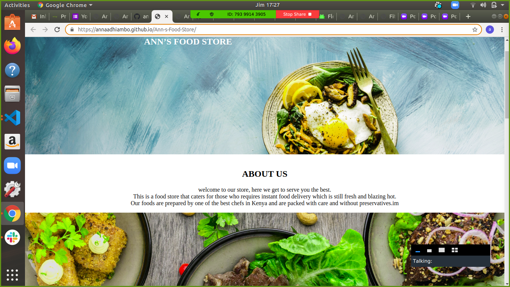

# Ann's Food 
This is a my first website that was helping me to go through the HTML,CSS and some part in Java Script.
Here is the website [link](https://annaadhiambo.github.io/Ann-s-Food-Store/)

## author
* Anna Adhiambo
## How to access it 
You can access it by cloning the [Repository](https://github.com/annaadhiambo/Ann-s-Food-Store.git)
```
$ git clone link 
$ cd directory-name
$ code .
```
## How to contribute
You can contribute by forking the project and cloning it by following the above process
 ## License and copyright
 Licensed under [MIT LICENSE](LICENSE)